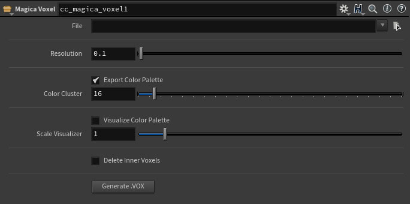
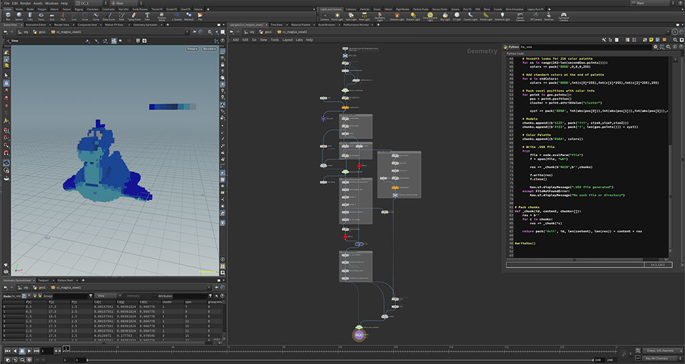
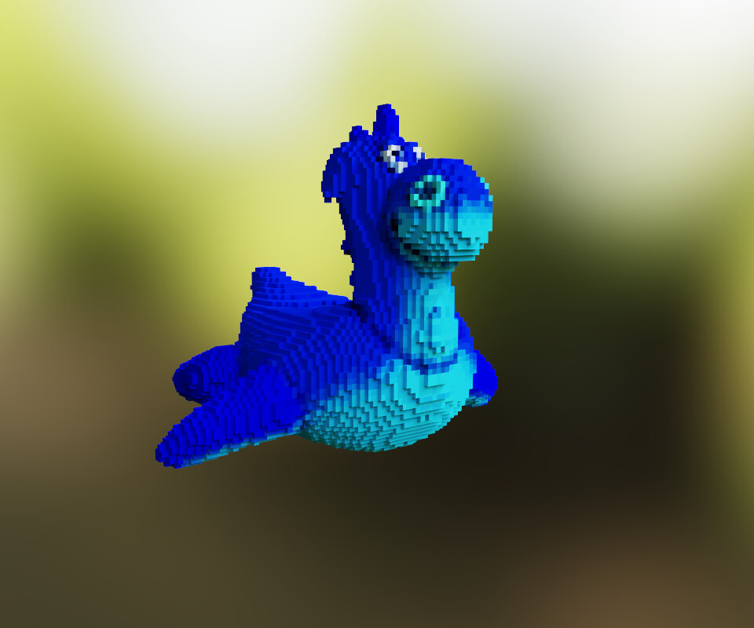
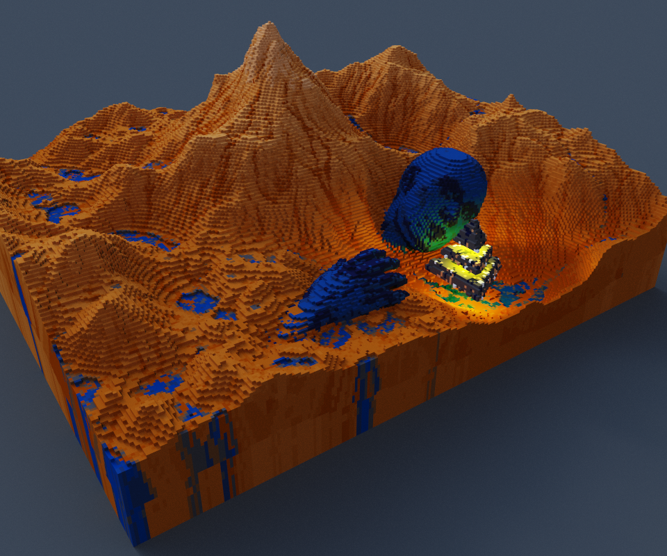

# Houdini to Magicavoxel
###### Houdini to MagicaVoxel Digital Asset.

###### Generates .VOX Magicavoxel (https://ephtracy.github.io/) file from given inputs.
###### Uses Magicavoxel file format definitions (https://github.com/ephtracy/voxel-model)

